<!--
  auroraeye-dev / README.md
  Hero + about cards are generated SVGs. To change any wording, edit the CONFIG
  block at the top of gen_hero.py / gen_about.py and re-run them (see SETUP.md).
-->

  

 

  

 

## ⚡ Stack

 

## 📊 By the numbers

  

  

 

## 🐍 Contribution snake

<picture>
  <source media="(prefers-color-scheme: dark)" srcset="https://raw.githubusercontent.com/auroraeye-dev/auroraeye-dev/output/snake-dark.svg">
  <source media="(prefers-color-scheme: light)" srcset="https://raw.githubusercontent.com/auroraeye-dev/auroraeye-dev/output/snake.svg">
  
</picture>

 

## 🛠 Currently building

<table>
<tr>
<td width="50%" valign="top">

**🧱 [Basalt](https://github.com/auroraeye-dev/basalt-v2)**
AI-assisted architecture diagramming for OT/ICS and cloud, with a deterministic validator behind it.

</td>
<td width="50%" valign="top">

**🧪 [Aletheon](https://github.com/auroraeye-dev/ALETHEON_AI_MVP_-1)**
Pharmaceutical drug-intelligence reports generated by a RAG pipeline tuned for source-grounding fidelity.

</td>
</tr>
<tr>
<td width="50%" valign="top">

**📡 [Samcast](https://github.com/auroraeye-dev/Samcast)**
Move screen content between macOS and iPadOS with a hand gesture. Swift.

</td>
<td width="50%" valign="top">

**📚 [BDH Foundation LLM](https://github.com/auroraeye-dev/BDH_foundation_LLM)**
A small language model that reads books and judges character-level consistency.

</td>
</tr>
</table>

 

`built, containerised, shipped — repeat`

